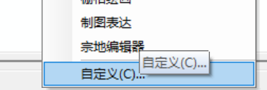
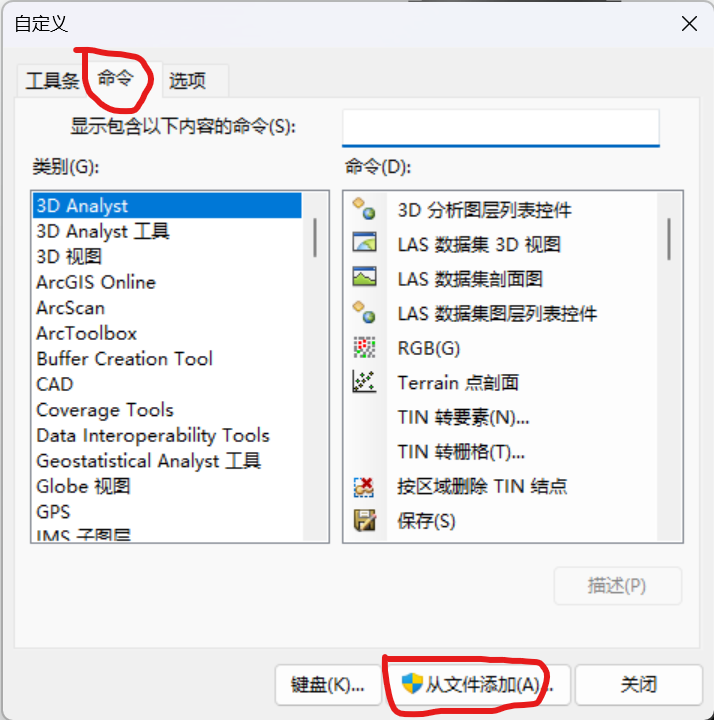
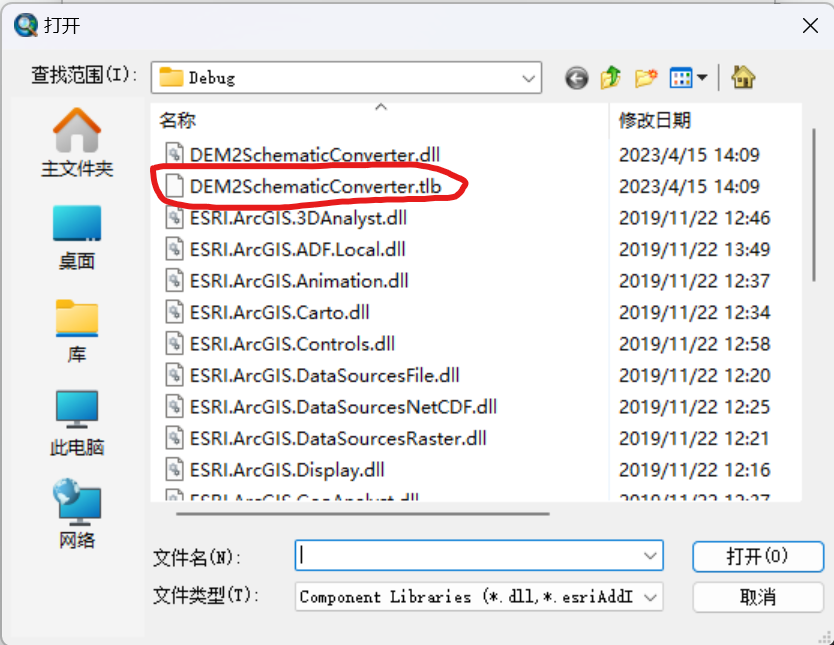
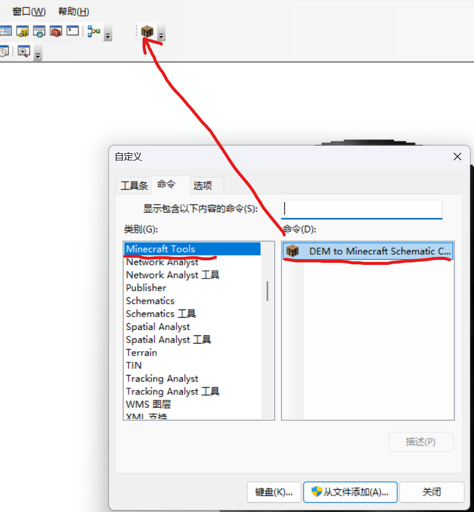
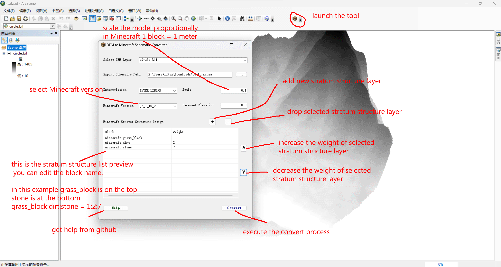

# DEM to Minecraft Schematic Converter Documentation

by [Jaffe2718](https://github.com/Jaffe2718)


## User Documentation

### Product Description
There are two kinds of products in this repository:
a command line tool and an ArcGIS plugin. 
The command line tool `dem2schema.exe` is is an executable file packaged and compiled by Python scripts through `Pyinstaller`.

The ArcGIS plugin is a C# Windows Forms plugin which can be used in ArcMap and ArcScene.
The plugin's core unit is the same as the command line tool, which is `dem2schema.exe`.

But the executable file `dem2schema.exe` is different command line tool and ArcGIS plugin.
For the command line tool, it is a command line tool which can be used in Windows command line.
But for the ArcGIS plugin, it is headless, which means it can run without any console window message.

### Command Line Tool

#### Installation
It does not need to be installed. Just download the executable file `dem2schema.exe` and put it in a folder.
You can add it's path into the system environment variable `PATH` to make it available in any folder.

#### Usage
It can convert a DEM file to a Minecraft schematic file. But Esri File Geo-database DEM is not supported.
If you add the path of `dem2schema.exe` into the system environment variable `PATH`, you can use it in any folder.

For help, you can use the following command:
```bash
dem2schema.exe -h
```

```bash
dem2schema.exe --help
```

If you want to get the supported Minecraft version, you can use the following command:
```bash
dem2schema.exe -v
```

```bash
dem2schema.exe --mc-versions
```

Then if you want to convert a DEM file to a Minecraft schematic file, you can use the following command:
```bash
dem2schema.exe <dem_path:str> <schema_path:str> [<interpolation=INTER_NEAREST>] [<scale=1.0>] [<pavement_elevation=0.0>] [<version=JE_1_19_2>] [<stratum_struct=[("minecraft:grass_block",1)]>]
```
```plaintext
Convert a DEM file to a Minecraft schematic file
        :param dem_path: DEM file path
        :param schema_path: output schematic file path (include file name)
        :param interpolation: interpolation method, default is INTER_LINEAR, can be:
                    INTER_NEAREST - a nearest-neighbor interpolation
                    INTER_LINEAR - a bi-linear interpolation (used by default)
                    INTER_AREA - resampling using pixel area relation. It may be a preferred method for image decimation,
                        as it gives moiré'-free results. But when the image is zoomed, it is similar to the INTER_NEAREST method.
                    INTER_CUBIC - a bicubic interpolation over 4x4 pixel neighborhood
                    INTER_LANCZOS4 - a Lanczos interpolation over 8x8 pixel neighborhood
                    INTER_LINEAR_EXACT - a bi-linear interpolation for exact downscaling
                    INTER_MAX - flag, gives maximum interpolation algorithm
                    WARP_FILL_OUTLIERS - flag, inverse mapping filling all the destination image pixels
                    WARP_INVERSE_MAP - flag, sets the mapping to be from destination image to source image
        :param scale: scale the linear size of the schematic from the real world data, default is 1.0
                    In minecraft, 1 block = 1 meter, the real world distance is depended on the spatial reference system
        :param pavement_elevation: elevation of pavement, default is 0.0
        :param version: version of the schematic, default is JE_1_19_2
        :param stratum_struct: python list of stratum structure, default is [("minecraft:grass_block",1)],
                    all the elements are tuple, the first element is the block name, the second element is the thickness weight.
                    For example, [("minecraft:grass_block",1),("minecraft:dirt",3),("minecraft:stone",5)], which means
                    the first layer is grass block, the second layer is dirt, the third layer is stone, and the thickness
                    of these blocks are block:dirt:stone = 1:3:5
```
There are is an example:
```bash
dem2schema.exe "E:\Coding\python\dem2schema\dem\circle.bil" "E:\Coding\python\dem2schema\schem\YueluMountain2.schem" INTER_LINEAR 0.1 0.0 JE_1_19_2 "[('minecraft:grass_block', 1), ('minecraft:dirt', 3), ('minecraft:stone', 6)]"
```
You should replace the DEM file path and the output schematic file path with your own path, and adjsut the scale, pavement elevation, version and stratum structure if you want.

### ArcGIS Plugin

#### Installation
1. You can download the plugin from the [release page](https://github.com/Jaffe2718/DEM2McSchem/releases).
2. Unzip all the files in the zip file, and put them in a folder.
3. Launch ArcMap or ArcScene.
4. Right click on the toolbar, and then click `Customize` in the context menu.

5. Click `Commands` in the `Customize` dialog.
6. Click `Add from File` in the dialog.

7. Select the `DEM2SchematicConverter.tbx` file in the folder you unziped in step 2, and click `Open`.

8. Click `OK` in the `Add Commands` dialog.
9. Then find the command `DEM to Minecraft Schematic Converter` in the category `Minecraft Tools`,
and drag it to the toolbar.

10. Click `Close` in the `Customize` dialog.

#### Usage

1. Create a Minecraft schematic file from a DEM file in ArcMap or ArcScene.

The user can use the plugin in ArcMap and ArcScene.
Warning: The raster data must have a spatial reference system,
and DEM data in Esri File Geo-database is not supported. And the DEM data must be a single band raster, nodata value mast less than -1e5

2. you can load the Minecraft schematic file into Minecraft by using the [WorldEdit](https://www.curseforge.com/minecraft/mc-mods/worldedit) mod.


## Developer Documentation

### Command Line Tool

1. Use Conda virtual environment to develop the command line tool.
The recommended way to develop the command line tool is to use conda virtual environment.
You should just install the dependencies for the command line tool in the virtual environment.
If you do not use conda virtual environment, the executable file `dem2schema.exe` created by Pyinstaller will be very large.
```bash
conda create -n dem2schema python=3.9
conda activate dem2schema
conda install -c conda-forge gdal
conda install -c conda-forge pyinstaller
conda install numpy
conda install opencv-python
conda install mcschematic
```

2. Use Pyinstaller to create the executable file `dem2schema.exe`.
```bash
# create the executable file as a command line tool
pyinstaller -F -i "path/to/your/icon.ico" dem2schema.py
```
### ArcGIS Plugin
1. You need to install `ArcGIS 10.8`, `Visual Studio 2017`, `.NET Framework 4.7.2`, and `ArcGIS SDK for .NET 10.8`.
2. Clone the repository.
```bash
git clone https://github.com/Jaffe2718/DEM2McSchem.git
```
3. Open the solution file `DEM2McSchem.sln` in Visual Studio 2017 and start to develop.
4. If you want to release the plugin, you should do the following steps:
> 1. Open the solution file `DEM2McSchem.sln` in Visual Studio 2017 with Administrator privilege.
> 2. Build the solution in `Release` mode.
> 3. Create Python script core tool for this plugin:
> ```bash
> pyinstaller -F -w -i "path/to/your/icon.ico" dem2schema.py
> ```
> Then copy the `dem2schema.exe` file built by Pyinstaller to the `bin/Release` folder of the plugin.
> 4. Zip the entire folder `bin/Release` of the plugin, you can rename the zip file to any name you want.
> 5. Then you can publish your zip file.

## Source Repository
The source repository is [here](https://github.com/Jaffe2718/DEM2McSchem).

## Contact
[Issues](https://github.com/Jaffe2718/DEM2McSchem/issues)

[Bilibili](https://space.bilibili.com/1671742926)

[Email](mailto:202130163019@hunnu.edu.cn)

## Additional Information
这其实是组件式地理信息系统开发课程的项目作业，但是我觉得这个项目还是挺有意思的，所以就把它放到了GitHub上。
This is the project assignment of the course "Component-based GIS Development", but I think this project is interesting, so I put it on GitHub.
